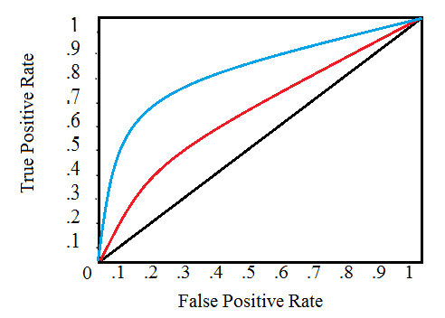

# Credit Risk Prediction
*By Aditya Nugraha*

## Business Understanding

### Context

Home Credit saat ini sedang menggunakan berbagai macam metode statistik dan Machine Learning untuk membuat prediksi skor kredit. Sekarang, kami meminta anda untuk membuka potensi maksimal dari data kami. Dengan melakukannya, kita dapat memastikan pelanggan yang mampu melakukan pelunasan tidak ditolak ketika melakukan pengajuan pinjaman, dan pinjaman dapat diberikan dengan principal, maturity, dan repayment calendar yang akan memotivsi pelanggan untuk sukses. Evaluasi akan dilakukan dengan mengecek seberapa dalam pemahaman analisa yang anda kerjakan.

### Problem Statement

Adanya potensi kerugian yang disebabkan oleh credit risk membuat perusahaan harus lebih berhati-hati dengan meminimalisir resiko tersebut, perusahaan juga sekaligus harus secara hati-hati agar langkah yang diambil kedepannya tidak menyebabkan kehilangan klien yang berpotensi. Dalam hal ini tim Data Science diminta untuk menemukan pola dalam data untuk meminimalisir kerugian akibat resiko tersebut sekaligus tidak menghilangkan klien yang berpotensi.

Dengan mengetahui calon debitur yang berpotensi memiliki kredit macet, dapat diminimalisir dengan cara menetapkan batas bawah skor evaluasi yang akan dipilih. selain itu, perusahaan dapat membuat strategi jika memang terjadi kredit macet agar tidak sampai mempengaruhi kinerja perusahaan secara langsung.

### Goals

Berdasarkan masalah tersebut, perusahaan ingin memiliki kemampuan memprediksi potensi kelayakan klien yang akan melakukan pengajuan kredit, sehingga dapat memaksimalkan keuntungan yang didapat dengan cara meminimalisir kemungkinan terjadinya kredit macet.

Dan juga, perusahaan ingin mengetahui apa yang membuat klien berpotensi atau tidak berpotensi memiliki kredit macet kedepannya. sehingga mereka dapat membuat rencana jika ada klien yang cukup beresiko tetapi perusahaan ingin mengambil resiko tersebut agar jika klien tersebut memang bermasalah maka tidak sampai mempengaruhi kinerja perusahaan secara langsung.

### Analytics Approach

Jadi yang akan kita lakukan adalah menganalisis data untuk menemukan pola yang membedakan klien apakah dia memiliki potensi kredit macet atau tidak.

kemudian kita akan membangun model klasifikasi yang akan membantu perusahaan untuk dapat memprediksi probabilitas seorang klien memiliki potensi kredit macet tersebut.

**Metric Evaluation: ROC AUC (biasa disebut AUROC)**

ROC (Receiver Operating Characteristics) adalah semacam alat ukur performance untuk classification problem dalam menentukan threshold dari suatu model. Contohnya: pada logistic regression, default dari thresholdnya adalah 0.5

AUC adalah luas area di bawah curve ROC

Kurva ROC dibuat berdasarkan nilai telah didapatkan pada perhitungan dengan confusion matrix, yaitu antara False Positive Rate dengan True Positive Rate. Dimana:

- False Positive Rate (FPR) = False Positive / (False Positive + True Negative)
- True Positive Rate (TPR) = True Positive / (True Positive + False Negative)

Dan berikut adalah contoh kurva ROC.

Untuk membaca kurva ini sangat mudah, kinerja algoritma klasifikasi adalah:

- JELEK, jika kurva yang dihasilkan mendekati garis baseline atau garis yang melintang dari titik 0,0.
- BAGUS, jika kurva mendekati titik 0,1.

Pada contoh di atas dapat dilihat 2 kurva, yaitu kurva dengan warna biru dan kurva dengan warna merah. Berdasarkan cara membaca di atas, maka dapat disimpulkan kinerja kurva berwarna biru lebih bagus dibandingkan kinerja kurva berwarna merah. dengan cara seperti ini maka kita dengan mudah membandingkan bagus atau tidaknya teknik-teknik yang digunakan untuk menyelesaikan kasus klasifikasi pada suatu percobaan.

Selain itu jika ingin membandingkan nilai kinerja kurva biru dan kurva merah dalam bentuk angka maka dapat dilakukan dengan membandingkan luas di bawah kurva atau Area Under Curve (AUC), dari gambar dapat dapat disimpulkan luas area kurva berwarna biru lebih besar dibanding luas area kurva berwarna merah.

Penelitian uji diagnostic akan semakin baik bila nilai AUC mendekati 1. 
- 0.5 ≤ AUC < 0.6 sangat lemah 
- 0.6 ≤ AUC < 0.7 lemah 
- 0.7 ≤ AUC < 0.8 sedang
- 0.8 ≤ AUC < 0.9 baik
- 0.9 ≤ AUC ≤ 1 sangat baik.

**Pada dunia credit risk modeling, umumnya AUC di atas 0.7 sudah termasuk performa yang baik**

References:
- https://stats.stackexchange.com/questions/132777/what-does-auc-stand-for-and-what-is-it
- https://staf.ulm.ac.id/rezafaisal/2017/01/12/menghitung-kinerja-algoritma-klasifikasi-pilih-roc-curve-atau-precision-recall-curve/

## Data Understanding

Data yang digunakan disediakan oleh Home Credit Indonesia, layanan yang didedikasikan untuk menyediakan jalur kredit (pinjaman) kepada populasi yang tidak memiliki rekening bank. Memprediksi apakah klien akan melunasi pinjaman atau mengalami kesulitan adalah kebutuhan bisnis yang penting, dan Home Credit menyelenggarakan virtual internship experience ini di platform Rakamin untuk melihat model seperti apa yang dapat dikembangkan komunitas pembelajaran mesin untuk membantu mereka dalam tugas ini.

- 0: Klien yang tidak memiliki kesulitan pembayaran
- 1: Klien yang memiliki kesulitan pembayaran (Keterlambatan, dll)

Ada 7 dataset berbeda:
- application_train/application_test: data train dan test utama dengan informasi tentang setiap aplikasi pinjaman di Home Credit. Setiap pinjaman memiliki baris sendiri dan diidentifikasi oleh kolom `SK_ID_CURR`. Data test dilengkapi dengan `TARGET` yang menunjukkan:
    - 0: Klien yang tidak memiliki kesulitan pembayaran
    - 1: Klien yang memiliki kesulitan pembayaran (Keterlambatan, dll)
- bureau: data tentang kredit klien sebelumnya dari lembaga keuangan lain. Setiap kredit sebelumnya memiliki baris sendiri di biro, tetapi satu pinjaman dalam data aplikasi dapat memiliki beberapa kredit sebelumnya.
- bureau_balance: data bulanan tentang kredit sebelumnya di biro. Setiap baris adalah satu bulan dari kredit sebelumnya, dan satu kredit sebelumnya dapat memiliki beberapa baris, satu untuk setiap bulan dari panjang kredit.
- previous_application: aplikasi pinjaman sebelumnya di Home Credit. Setiap pinjaman saat ini dalam data aplikasi dapat memiliki beberapa pinjaman sebelumnya. Setiap aplikasi sebelumnya memiliki satu baris dan diidentifikasi oleh kolom `SK_ID_PREV`.
- POS_CASH_BALANCE: data bulanan tentang titik penjualan sebelumnya atau pinjaman tunai yang dimiliki klien dengan Home Credit. Setiap baris adalah satu bulan dari titik penjualan atau pinjaman tunai sebelumnya, dan satu pinjaman sebelumnya dapat memiliki banyak baris.
- credit_card_balance: data bulanan tentang kartu kredit milik klien sebelumnya dengan Home Credit. Setiap baris adalah satu bulan dari saldo kartu kredit, dan satu kartu kredit dapat memiliki banyak baris.
- installments_payment: riwayat pembayaran pinjaman sebelumnya di Home Credit. Ada satu baris untuk setiap pembayaran yang dilakukan dan satu baris untuk setiap pembayaran yang terlewat.
